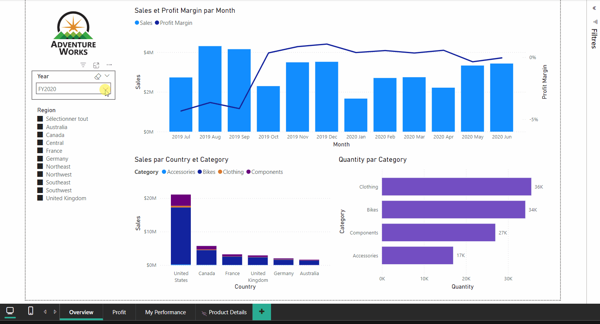
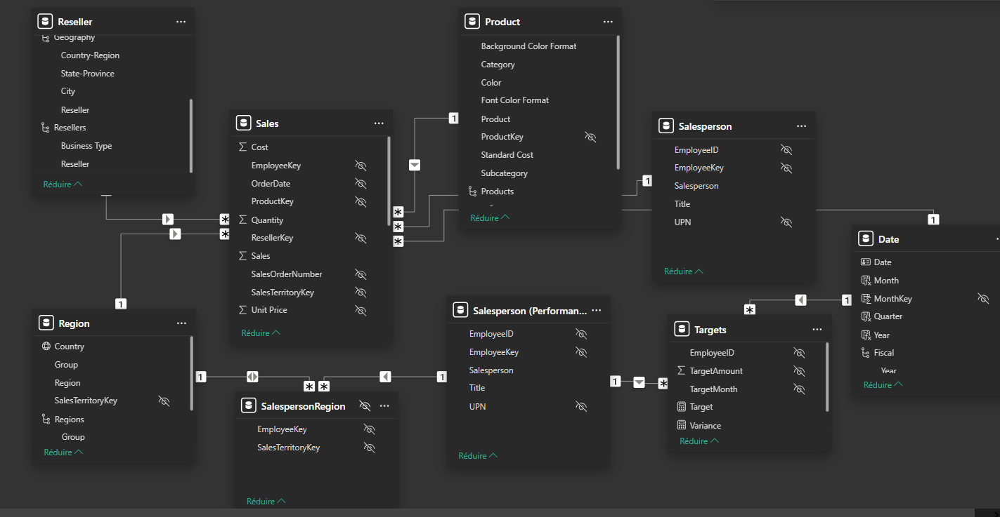

# PowerBI_Sales_Analysis
# Sales Analysis Report - Adventure Works



## 📊 Overview  
This Power BI report analyzes **Adventure Works** sales data across multiple regions (Europe, Canada, and Australia).  
The company specializes in **clothing, bicycles, and accessories**.  

The report provides insights into:  
- Sales performance by **region**, **year**, and **product categories**.  
- Profit and cost analysis.  
- Ranking of **top-performing salespeople**.  

---

## 🔍 Report Pages  

### 1. **Overview**  
This page presents key performance indicators (KPIs) by **region**, **year**, and **product categories**.  
---

### 2. **Profit**  
This page focuses on **profitability** and **cost analysis**, offering insights into financial performance.  

---

### 3. **My Performance**  
This page ranks the **top-performing salespeople** (Salesperson) and compares their performance against targets.  

---

### 4. **Product Details**  
Detailed breakdown by products, including metrics like **average price** and **maximum price** with Row-level data security.  

---

## ⚙️ Data Model  
The report uses a clean and optimized **data model**:  


---

## 📈 Key Measures  

Here are some key DAX measures created for this report:

### **1. Target**   :
Calculates the total target amount for a salesperson.  
```DAX
Target = 
IF(
    HASONEVALUE('Salesperson (Performance)'[Salesperson]),
    SUM(Targets[TargetAmount])
)
```
###**2. Variance** :
Calculates the difference between actual sales and target amounts.
```DAX
Variance = 
IF(
    HASONEVALUE('Salesperson (Performance)'[Salesperson]),
    SUM(Sales[Sales]) - [Target]
)
```
###**3. Sales YoY Growth** :
Calculates Year-over-Year growth for sales.
```DAX
Sales YoY Growth = 
VAR SalesPriorYear =
    CALCULATE(
        SUM(Sales[Sales]),
        PARALLELPERIOD(
            'Date'[Date],
            -12,
            MONTH
        )
    )
RETURN
    DIVIDE(
        (SUM(Sales[Sales]) - SalesPriorYear),
        SalesPriorYear
    )
```

## 🚀 Features
- Interactive Hierarchies: Navigate through regions and resellers seamlessly.
- Pricing Metrics: Includes calculated fields such as Average Price and Maximum Price.
- Performance Tracking: Compare actual sales to target values.
- Power Query Preparation: Data cleaned, transformed, and structured for analysis.
  
## 📂 Repository Contents
SalesAnalysis.pbix: Power BI Report File.

## Auteur
Alexandra Jane Bitom
